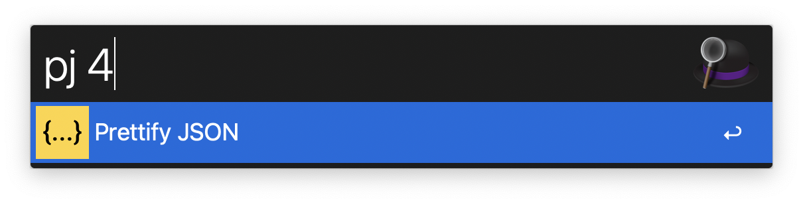
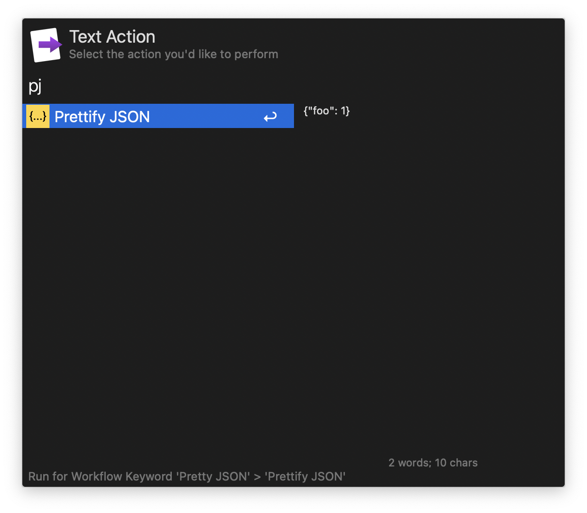

This workflow formats JSON.

# Getting Started
Pretty JSON takes a JSON string from your clipboard, formats it and copies it back to your clipboard. Just copy some JSON and run it by typing `pj` in Alfred.

## Advanced
- You can set the desired indent depth in the workflow settings. Default is 2 spaces.
- You can give `pj` a number as an argument to override the default indent depth

- You can run pj as a text action

